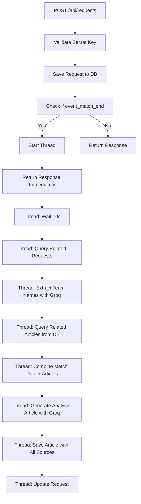

# 🚀 Async Article Generation API

## 📋 Overview

API `/api/requests` đã được nâng cấp để xử lý tạo bài viết trong thread riêng với delay 20 giây. Khi nhận được request `type: "event_match_end"`, API sẽ:

1. **Lưu request ngay lập tức** và return response
2. **Khởi tạo thread riêng** để xử lý tạo bài viết
3. **Delay 20 giây** trước khi bắt đầu tạo bài viết
4. **Tạo bài viết** sử dụng Groq API
5. **Cập nhật request** với kết quả

## 🔧 Technical Implementation

### Thread Management
```python
# Khởi tạo thread riêng
thread = threading.Thread(
    target=process_article_generation_async,
    args=(fixture_id, related_requests, str(result.inserted_id)),
    name=f"ArticleGen-{fixture_id}"
)
thread.daemon = True
thread.start()
```

### Async Processing Function
```python
def process_article_generation_async(fixture_id, related_requests, request_id):
    # Delay 20 seconds
    time.sleep(20)
    
    # Process article generation
    # Update database with results
```

## 📊 API Response

### Immediate Response (0s)
```json
{
    "success": true,
    "message": "Request saved successfully",
    "request_id": "64f8a1b2c3d4e5f6a7b8c9d0",
    "created_at": "2024-01-15T10:30:00.000Z",
    "article_generated": false,
    "article_generation_status": "processing",
    "article_generation_started_at": "2024-01-15T10:30:00.000Z"
}
```

### After 20+ seconds
Request sẽ được cập nhật với:
- `article_generated`: true/false
- `generated_article_id`: ID của bài viết đã tạo
- `article_generated_at`: Thời gian hoàn thành

## 🔍 Logging & Debugging

### Thread Logs
```
🚀 Starting async article generation for fixture_id: fixture_123
📋 Thread ID: 140234567890
⏰ Waiting 10 seconds before processing...
⏰ 10s delay completed, starting article generation for fixture_id: fixture_123
📄 Collected 5 articles for generation
🏆 Step 1: Extracting team names for fixture_id: fixture_123
🔍 Extracting team names with Groq...
🏆 Groq team names response: Chelsea, CHE, Blues, Liverpool, LIV, Reds
🏆 Extracted 6 team name variations: ['Chelsea', 'CHE', 'Blues', 'Liverpool', 'LIV', 'Reds']
✅ Team names extracted successfully: ['Chelsea', 'CHE', 'Blues', 'Liverpool', 'LIV', 'Reds']
📰 Step 2: Querying related articles for teams: ['Chelsea', 'CHE', 'Blues', 'Liverpool', 'LIV', 'Reds']
📅 Querying articles from: 2024-01-13T10:30:00.000Z (48h ago)
🔍 Search pattern: Chelsea|CHE|Blues|Liverpool|LIV|Reds
📰 Found 8 related articles in the last 48h
📄 Article 1: Chelsea's recent form has been impressive...
📄 Article 2: Liverpool's tactical changes...
🔄 Step 3: Combining match data and related articles
📊 Adding 5 match events
📰 Adding 8 related articles
🔄 Combined data: 13 total sources
🤖 Step 4: Generating analysis article for fixture_id: fixture_123
📊 Sources: 5 match events + 8 related articles
✅ Generated article saved with ID: 64f8a1b2c3d4e5f6a7b8c9d1
✅ Updated request 64f8a1b2c3d4e5f6a7b8c9d0 with generated article info
```

### Error Logs
```
❌ Error in async article generation for fixture_id fixture_123: Connection timeout
📋 Traceback: [full traceback]
❌ Failed to update request with error: Database connection failed
```

## 🧪 Testing

### Test Scripts
1. **`test_async_article_generation.py`** - Basic functionality test
2. **`test_api_with_secret_async.py`** - Test with actual secret key
3. **`monitor_threads.py`** - Monitor thread activity and logs

### Running Tests
```bash
# Basic test
python test_async_article_generation.py

# Test with secret key
python test_api_with_secret_async.py

# Monitor threads
python monitor_threads.py
```

## 🔐 Security

### Secret Key Authentication
API yêu cầu secret key qua:
- **Query parameter**: `?secret_key=your_key`
- **Header**: `X-Secret-Key: your_key`

### Key Sources (in order of priority)
1. Query param `secret_key`
2. Query param `SECRET_KEY`
3. Header `X-Secret-Key`
4. Header `X-SECRET-KEY`

## 📈 Performance

### Thread Safety
- **Daemon threads**: Tự động kết thúc khi main thread kết thúc
- **Database updates**: Thread-safe MongoDB operations
- **Error handling**: Comprehensive error logging and recovery

### Concurrent Processing
- Multiple requests có thể được xử lý đồng thời
- Mỗi request có thread riêng
- Không block main API response

## 🔄 Workflow



## 🛠️ Configuration

### Environment Variables
```bash
SECRET_KEY=your_secret_key_here
GROQ_KEY=your_groq_api_key
```

### MongoDB Collections
- **`requests`**: Lưu trữ raw requests
- **`generated_articles`**: Lưu trữ bài viết đã tạo (bao gồm team names)
- **`articles`**: Lưu trữ source articles

### Generated Article Document Structure
```json
{
    "_id": "64f8a1b2c3d4e5f6a7b8c9d1",
    "fixture_id": "fixture_123",
    "title": "Match Analysis - Fixture fixture_123",
    "content": "Generated analysis article content...",
    "source_requests_count": 5,
    "related_articles_count": 8,
    "team_names": ["Chelsea", "CHE", "Blues", "Liverpool", "LIV", "Reds"],
    "team_names_raw": "Chelsea, CHE, Blues, Liverpool, LIV, Reds",
    "related_articles_ids": ["64f8a1b2c3d4e5f6a7b8c9d2", "64f8a1b2c3d4e5f6a7b8c9d3"],
    "generated_at": "2024-01-15T10:30:00.000Z",
    "created_at": "2024-01-15T10:30:00.000Z",
    "request_id": "64f8a1b2c3d4e5f6a7b8c9d0"
}
```

## 📝 Usage Examples

### cURL Example
```bash
curl -X POST 'http://localhost:5000/api/requests?secret_key=your_key' \
     -H 'Content-Type: application/json' \
     -d '{
       "type": "event_match_end",
       "fixture_id": "fixture_123",
       "match_data": {
         "home_team": "Chelsea",
         "away_team": "Liverpool",
         "score": "2-1"
       }
     }'
```

### Python Example
```python
import requests

response = requests.post(
    'http://localhost:5000/api/requests',
    params={'secret_key': 'your_key'},
    json={
        'type': 'event_match_end',
        'fixture_id': 'fixture_123',
        'match_data': {'home_team': 'Chelsea', 'away_team': 'Liverpool'}
    }
)

print(response.json())
```

## 🚨 Troubleshooting

### Common Issues
1. **Secret key validation failed**: Check key format and source
2. **Thread not starting**: Check logs for initialization errors
3. **Article generation timeout**: Check Groq API key and network
4. **Database update failed**: Check MongoDB connection

### Debug Steps
1. Check server logs for thread activity
2. Verify secret key configuration
3. Test with provided test scripts
4. Monitor database for updates

## 📊 Monitoring

### Key Metrics
- Thread start time
- Article generation duration
- Success/failure rates
- Database update frequency

### Log Patterns
- `🚀 Starting async article generation` - Thread started
- `⏰ 20s delay completed` - Processing begins
- `✅ Generated article saved` - Success
- `❌ Error in async article generation` - Failure
